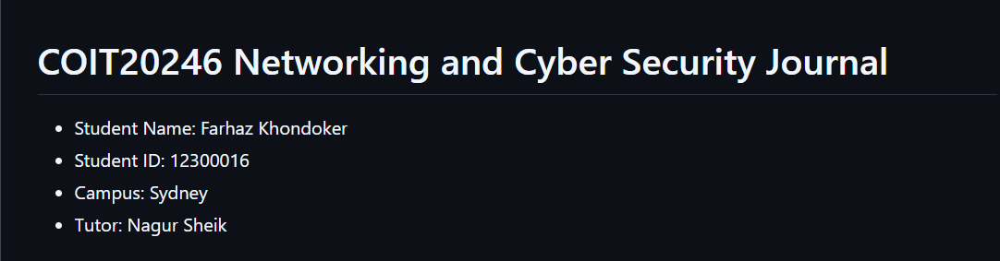
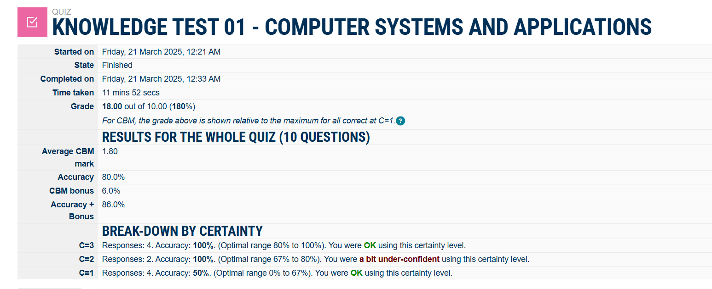

# Week 1 | Unit Introduction

## Task 5. Summary of My Knowledge

I have previously studied a Bachelor of Business Administration majoring in Management Information Systems. My MIS background and a year of professional experience as a developer will help me to get well acquainted with the Networking and Cyber Security course. I have a strong foundation of programming languages:

- Python(Intermediate)
- C++
- Basics of JavaScript
  
Besides these I have skills related to-

- Problem Solving
- Critical Thinking
- Effective Analysing 

The following is a screenshot of my details:

## Task 5. Knowledge Test Score

The following is a screenshot of my Knowledge Test score:

