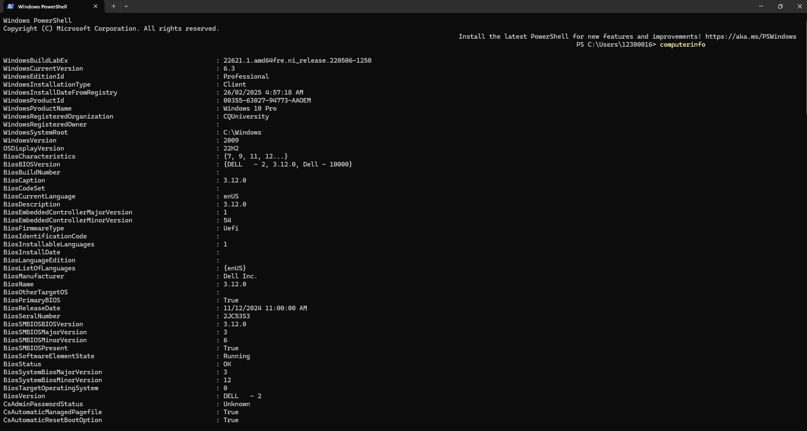
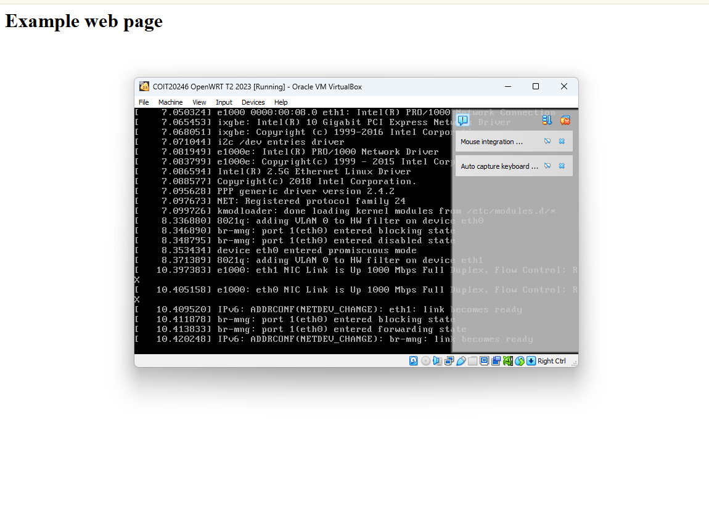
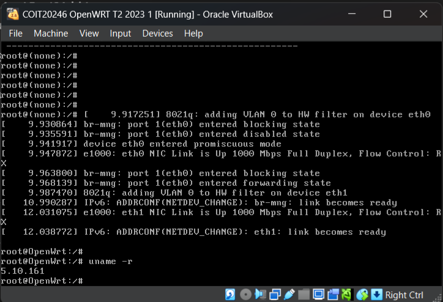
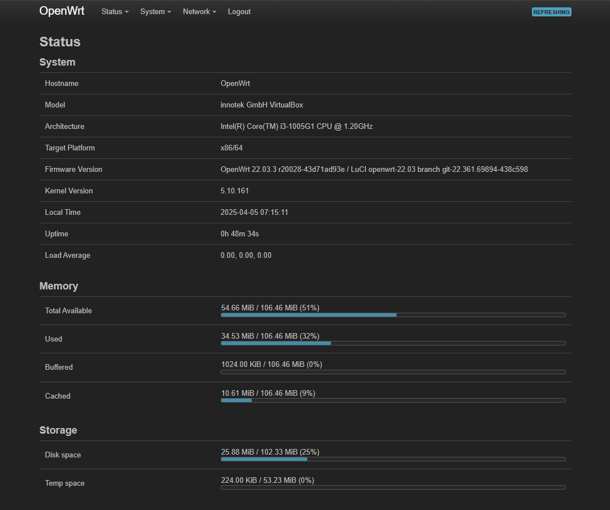
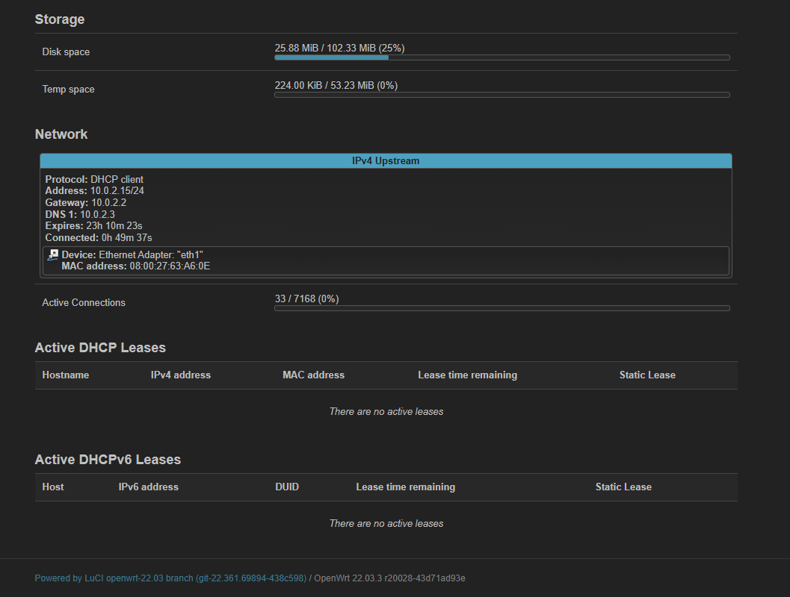
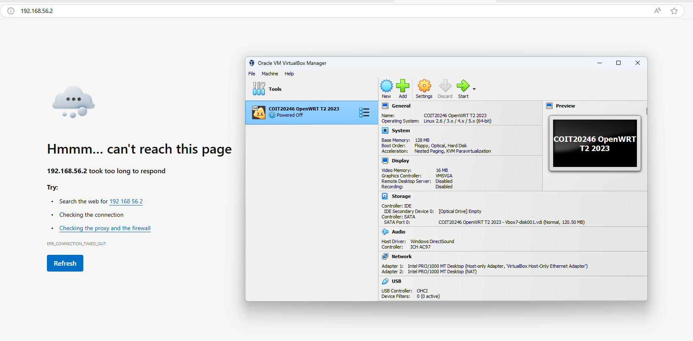

# Week 2 | Computer Systems and Applications

## Task 1. Knowledge Test 01

## Knowledge Test 02

## Task 2. View Computer Information
Windows PowerShell
Copyright (C) Microsoft Corporation. All rights reserved.
                                                                                                                        Install the latest PowerShell for new features and improvements! https://aka.ms/PSWindows                                                                                                                                                       PS C:\Users\12300016> computerinfo

WindowsBuildLabEx                                       : 22621.1.amd64fre.ni_release.220506-1250
WindowsCurrentVersion                                   : 6.3
WindowsEditionId                                        : Professional
WindowsInstallationType                                 : Client
WindowsInstallDateFromRegistry                          : 26/02/2025 4:57:18 AM
WindowsProductId                                        : 00355-63027-94773-AAOEM
WindowsProductName                                      : Windows 10 Pro
WindowsRegisteredOrganization                           : CQUniversity
WindowsRegisteredOwner                                  :
WindowsSystemRoot                                       : C:\Windows
WindowsVersion                                          : 2009
OSDisplayVersion                                        : 22H2
BiosCharacteristics                                     : {7, 9, 11, 12...}
BiosBIOSVersion                                         : {DELL   - 2, 3.12.0, Dell - 10000}
BiosBuildNumber                                         :
BiosCaption                                             : 3.12.0
BiosCodeSet                                             :
BiosCurrentLanguage                                     : enUS
BiosDescription                                         : 3.12.0
BiosEmbeddedControllerMajorVersion                      : 1
BiosEmbeddedControllerMinorVersion                      : 54
BiosFirmwareType                                        : Uefi
BiosIdentificationCode                                  :
BiosInstallableLanguages                                : 1
BiosInstallDate                                         :
BiosLanguageEdition                                     :
BiosListOfLanguages                                     : {enUS}
BiosManufacturer                                        : Dell Inc.
BiosName                                                : 3.12.0
BiosOtherTargetOS                                       :
BiosPrimaryBIOS                                         : True
BiosReleaseDate                                         : 11/12/2024 11:00:00 AM
BiosSeralNumber                                         : 2JC53S3
BiosSMBIOSBIOSVersion                                   : 3.12.0
BiosSMBIOSMajorVersion                                  : 3
BiosSMBIOSMinorVersion                                  : 6
BiosSMBIOSPresent                                       : True
BiosSoftwareElementState                                : Running
BiosStatus                                              : OK
BiosSystemBiosMajorVersion                              : 3
BiosSystemBiosMinorVersion                              : 12
BiosTargetOperatingSystem                               : 0
BiosVersion                                             : DELL   - 2
CsAdminPasswordStatus                                   : Unknown
CsAutomaticManagedPagefile                              : True
CsAutomaticResetBootOption                              : True
CsAutomaticResetCapability                              : True
CsBootOptionOnLimit                                     :
CsBootOptionOnWatchDog                                  :
CsBootROMSupported                                      : True
CsBootStatus                                            : {0, 0, 0, 39...}
CsBootupState                                           : Normal boot
CsCaption                                               : CQU011572
CsChassisBootupState                                    : Safe
CsChassisSKUNumber                                      : Desktop
CsCurrentTimeZone                                       : 660
CsDaylightInEffect                                      : True
CsDescription                                           : AT/AT COMPATIBLE
CsDNSHostName                                           : CQU011572
CsDomain                                                : WORKGROUP
CsDomainRole                                            : StandaloneWorkstation
CsEnableDaylightSavingsTime                             : True
CsFrontPanelResetStatus                                 : Unknown
CsHypervisorPresent                                     : True
CsInfraredSupported                                     : False
CsInitialLoadInfo                                       :
CsInstallDate                                           :
CsKeyboardPasswordStatus                                : Unknown
CsLastLoadInfo                                          :
CsManufacturer                                          : Dell Inc.
CsModel                                                 : Precision 3460
CsName                                                  : CQU011572
CsNetworkAdapters                                       : {Ethernet, Ethernet 2}
CsNetworkServerModeEnabled                              : True
CsNumberOfLogicalProcessors                             : 20
CsNumberOfProcessors                                    : 1
CsProcessors                                            : {12th Gen Intel(R) Core(TM) i7-12700}
CsOEMStringArray                                        : {Dell System, 1[0AC7], 3[1.0], 12[www.dell.com]...}
CsPartOfDomain                                          : False
CsPauseAfterReset                                       : -1
CsPCSystemType                                          : Desktop
CsPCSystemTypeEx                                        : Desktop
CsPowerManagementCapabilities                           :
CsPowerManagementSupported                              :
CsPowerOnPasswordStatus                                 : Unknown
CsPowerState                                            : Unknown
CsPowerSupplyState                                      : Safe
CsPrimaryOwnerContact                                   :
CsPrimaryOwnerName                                      :
CsResetCapability                                       : Other
CsResetCount                                            : -1
CsResetLimit                                            : -1
CsRoles                                                 : {LM_Workstation, LM_Server, NT}
CsStatus                                                : OK
CsSupportContactDescription                             :
CsSystemFamily                                          : Precision
CsSystemSKUNumber                                       : 0AC7
CsSystemType                                            : x64-based PC
CsThermalState                                          : Safe
CsTotalPhysicalMemory                                   : 34033328128
CsPhyicallyInstalledMemory                              : 33554432
CsUserName                                              : STUDENT\12300016
CsWakeUpType                                            : PowerSwitch
CsWorkgroup                                             : WORKGROUP
OsName                                                  : Microsoft Windows 11 Pro
OsType                                                  : WINNT
OsOperatingSystemSKU                                    : 48
OsVersion                                               : 10.0.22621
OsCSDVersion                                            :
OsBuildNumber                                           : 22621
OsHotFixes                                              : {KB5044033, KB5041655, KB5044285, KB5046247}
OsBootDevice                                            : \Device\HarddiskVolume1
OsSystemDevice                                          : \Device\HarddiskVolume3
OsSystemDirectory                                       : C:\Windows\system32
OsSystemDrive                                           : C:
OsWindowsDirectory                                      : C:\Windows
OsCountryCode                                           : 1
OsCurrentTimeZone                                       : 660
OsLocaleID                                              : 0409
OsLocale                                                : en-US
OsLocalDateTime                                         : 21/03/2025 12:01:00 PM
OsLastBootUpTime                                        : 21/03/2025 3:02:53 AM
OsUptime                                                : 08:58:07.2123699
OsBuildType                                             : Multiprocessor Free
OsCodeSet                                               : 1252
OsDataExecutionPreventionAvailable                      : True
OsDataExecutionPrevention32BitApplications              : True
OsDataExecutionPreventionDrivers                        : True
OsDataExecutionPreventionSupportPolicy                  : OptIn
OsDebug                                                 : False
OsDistributed                                           : False
OsEncryptionLevel                                       : 256
OsForegroundApplicationBoost                            : Maximum
OsTotalVisibleMemorySize                                : 33235672
OsFreePhysicalMemory                                    : 22951204
OsTotalVirtualMemorySize                                : 38216408
OsFreeVirtualMemory                                     : 27175564
OsInUseVirtualMemory                                    : 11040844
OsTotalSwapSpaceSize                                    :
OsSizeStoredInPagingFiles                               : 4980736
OsFreeSpaceInPagingFiles                                : 4980736
OsPagingFiles                                           : {C:\pagefile.sys}
OsHardwareAbstractionLayer                              : 10.0.22621.2506
OsInstallDate                                           : 26/02/2025 3:57:18 PM
OsManufacturer                                          : Microsoft Corporation
OsMaxNumberOfProcesses                                  : 4294967295
OsMaxProcessMemorySize                                  : 137438953344
OsMuiLanguages                                          : {en-US}
OsNumberOfLicensedUsers                                 :
OsNumberOfProcesses                                     : 237
OsNumberOfUsers                                         : 1
OsOrganization                                          : CQUniversity
OsArchitecture                                          : 64-bit
OsLanguage                                              : en-US
OsProductSuites                                         : {TerminalServicesSingleSession}
OsOtherTypeDescription                                  :
OsPAEEnabled                                            :
OsPortableOperatingSystem                               : False
OsPrimary                                               : True
OsProductType                                           : WorkStation
OsRegisteredUser                                        :
OsSerialNumber                                          : 00355-63027-94773-AAOEM
OsServicePackMajorVersion                               : 0
OsServicePackMinorVersion                               : 0
OsStatus                                                : OK
OsSuites                                                : {TerminalServices, TerminalServicesSingleSession}
OsServerLevel                                           :
KeyboardLayout                                          : en-US
TimeZone                                                : (UTC+10:00) Canberra, Melbourne, Sydney
LogonServer                                             : \\CQU011572
PowerPlatformRole                                       : Desktop
HyperVisorPresent                                       : True
HyperVRequirementDataExecutionPreventionAvailable       :
HyperVRequirementSecondLevelAddressTranslation          :
HyperVRequirementVirtualizationFirmwareEnabled          :
HyperVRequirementVMMonitorModeExtensions                :
DeviceGuardSmartStatus                                  : Off
DeviceGuardRequiredSecurityProperties                   : {0}
DeviceGuardAvailableSecurityProperties                  : {BaseVirtualizationSupport, SecureBoot, DMAProtection, 5...}
DeviceGuardSecurityServicesConfigured                   : {HypervisorEnforcedCodeIntegrity}
DeviceGuardSecurityServicesRunning                      : {HypervisorEnforcedCodeIntegrity}
DeviceGuardCodeIntegrityPolicyEnforcementStatus         : EnforcementMode
DeviceGuardUserModeCodeIntegrityPolicyEnforcementStatus : AuditMode
PS C:\Users\12300016>

RAM: CsTotalPhysicalMemory = 34,033,328,128 bytes
Disk: OsSizeStoredInPagingFiles = 4,980,736,000 bytes

## Task 3. Deploy Linux Web Server

- boot manager: It is the operating system which loads when the computer starts. For the above Linux server it is **GNU GRUB Version 2.06**. We can find this when 
 we start the virtual machine and a following interface(shown below) will pop up and then the boot manager version and type will be specified on the first.

 
- Kernel: The kernel is the core of the operating system, responsible for managing hardware resources, system calls, memory, and processes. We can find the exact kernel version by simply typing- **uname -r** in the prompt after the virtual machine is seen running. Our version is 5.10.161

- **VirtualBox:** VirtualBox is a software tool that allows to run one or more operating systems inside the existing operating system. It works like a virtual computer that runs inside the physical computer. It is used to run different operating systems, test software, or even try out a new OS without changing anything on the main computer.
- **OpenWRT:** OpenWRT is an open-source operating system based on Linux, mainly designed for routers and other network devices. It allows to replace the default firmware of the routers with a more customizable version, offering better performance, security, and control over network features. It's useful for people who want to maximize router's capabilities.

**AI Chatbot Descriptions: ChatGPT**
AI Description of VirtualBox and OpenWRT:
Prompt: "Create a short description of VirtualBox and OpenWRT so a new IT student can understand them."
**Response**
Short Descriptions of VirtualBox and OpenWRT

VirtualBox: VirtualBox is a free and open-source software that allows you to create and run virtual machines on your computer. You can install multiple operating systems (like Linux, Windows, or macOS) on your PC or laptop as "virtual machines" without affecting your main operating system. It's like creating a computer inside your computer, letting you test or use different operating systems safely.
OpenWRT: OpenWRT is a Linux-based operating system designed specifically for embedded devices, such as routers. It provides advanced features and customization options compared to the default firmware that most routers come with. With OpenWRT, users can improve security, add new features, and fine-tune the performance of their router, turning it into a more powerful and flexible device.

**Comparison and Commentary:**
Comparison: The AI description of VirtualBox and OpenWRT is very similar to mine. Both describe VirtualBox as a virtual machine tool for running other operating systems, and OpenWRT as an operating system for routers to enhance performance and control. Both descriptions cover the main points well, but the AI response is slightly more succinct and beginner-friendly.

## Task 4. Browse to OpenWRT Websites
Example Web page

Management

Network

System Information (OpenWRT)
Hostname: OpenWrt
Model: innotek GmbH VirtualBox
Architecture: Intel(R) Core(TM) i3-1005G1 CPU @ 1.20GHz
Target Platform: x86/64
Firmware Version: OpenWrt 22.03.3 r20028-43d71ad93e
LuCI: openwrt-22.03 branch git-22.361.69894-438c598
Kernel Version: 5.10.161
Local Time: 2025-04-05 07:19:01
Uptime: 0h 52m 24s
Load Average: 0.00, 0.00, 0.00

