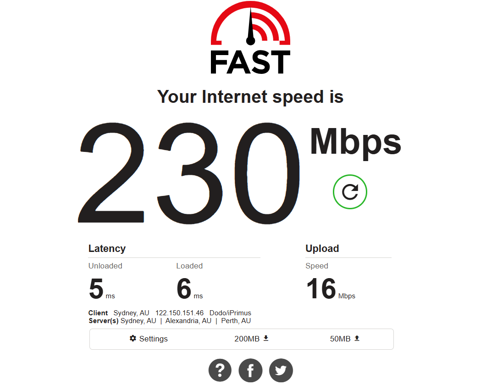

# Week 3 | Tutorial

## Task 1. Knowledge Test


## Task 2. View Your Addresses


**Ethernet Adapter: Ethernet (Main Network Connection)**

- **Physical Address:** `00-BE-43-BA-4E-CF`  
  → This is the **MAC address**, a unique hardware ID for the Ethernet network interface.

- **IPv4 Address:** `10.162.32.185`  
  → This is the **local IP address** on the network, used for communication within the university’s network.

- **Link-local IPv6 Address:** `fe80::9a72:1b3:d59b:9ddf%8`  
  → An **IPv6 address** used for communication within the local network segment only (not routable on the internet).

- **Default Gateway:** `10.162.32.1`  
  → The **router IP address** the computer uses to access the internet or external networks.

- **DHCP Server:** `138.77.208.14`  
  → The **DHCP server** that assigns IP addresses dynamically to devices on the network.

- **DNS Servers:**  
  - `10.8.0.25`  
  - `10.8.0.26`  
  - `138.77.5.15`  
  - `138.77.5.19`  
  → These are **DNS servers** used to resolve domain names (for example `google.com`) into IP addresses.


**Ethernet Adapter: Ethernet 2 (VirtualBox Host-Only)**

- **Physical Address:** `0A-00-27-00-00-09`  
  → MAC address for the VirtualBox virtual adapter.

- **IPv4 Address:** `192.168.56.1`  
  → This is a **host-only adapter address** used for local communication between the physical machine and virtual machines (not connected to external networks).

- **Link-local IPv6 Address:** `fe80::8f4f:e810:fcd1:9452%9`  
  → Local IPv6 address for VirtualBox host-only adapter.


**Tunnel Adapter: Teredo (IPv6 Tunneling)**

- **Physical Address:** `00-00-00-00-00-00-00-E0`  
  → A virtual MAC for the Teredo tunnel interface.

- **IPv6 Address:** `2001:0:2851:fc0b:1cff:fle3:75b2:2946`  
  → A **public IPv6 address** tunneled over IPv4, used for IPv6 communication through an IPv4 NAT device.

- **Link-local IPv6 Address:** `fe80::1cff:1fe3:75b2:2946%11`  
  → Local scope address for Teredo interface.

## Task 3. Ping Your Local Router


**Values of Delays and How They Were Found**

Used two commands to test network delay:
- `Test-Connection`
- `ping 10.162.32.1`

From the **output** of these commands:

From `Test-Connection`:
Each response from `10.162.32.1` shows:
- **Latency**: `1 ms`  
  → This is the time it took for the ping packet to go to the destination and back (round-trip).

From `ping` command:
```
Reply from 10.162.32.1: bytes=32 time=1ms TTL=254
Reply from 10.162.32.1: bytes=32 time=1ms TTL=254
Reply from 10.162.32.1: bytes=32 time=1ms TTL=254
Reply from 10.162.32.1: bytes=32 time=2ms TTL=254
```

- **Minimum delay:** `1 ms`
- **Maximum delay:** `2 ms`
- **Average delay:** `1 ms`

**Factors That Impact Network Delay**

Several factors can affect the delay (latency) between two networked devices:

Physical distance: Longer distances mean longer travel time for data.
Network congestion: Heavy traffic can slow down data transmission.
Router/switch hops: More devices between source and destination increase delay.
Hardware quality: Slower network cards or cables can cause delays.
Wireless vs Wired: Wireless networks usually have more delay than wired ones.
Firewalls or packet checks: Security scans can slow down data flow.
Virtual environments: Running in VirtualBox may add slight delay.


## Task 4. Ping your OpenWRT Linux Server

root@OpenWrt:~# ip addr
1: lo: <LOOPBACK,UP,LOWER_UP> mtu 65536 qdisc noqueue state UNKNOWN qlen 1000
    link/loopback 00:00:00:00:00:00 brd 00:00:00:00:00:00
    inet 127.0.0.1/8 scope host lo
       valid_lft forever preferred_lft forever
    inet6 ::1/128 scope host
       valid_lft forever preferred_lft forever
2: eth0: <BROADCAST,MULTICAST,UP,LOWER_UP> mtu 1500 qdisc fq_codel master br-mng                                                                                                                                                              state UP qlen 1000
    link/ether 08:00:27:05:f0:3c brd ff:ff:ff:ff:ff:ff
3: eth1: <BROADCAST,MULTICAST,UP,LOWER_UP> mtu 1500 qdisc fq_codel state UP qlen                                                                                                                                                              1000
    link/ether 08:00:27:e2:ae:45 brd ff:ff:ff:ff:ff:ff
    inet 10.0.3.15/24 brd 10.0.3.255 scope global eth1
       valid_lft forever preferred_lft forever
    inet6 fe80::a00:27ff:fee2:ae45/64 scope link
       valid_lft forever preferred_lft forever
4: br-mng: <BROADCAST,MULTICAST,UP,LOWER_UP> mtu 1500 qdisc noqueue state UP qle                                                                                                                                                             n 1000
    link/ether 08:00:27:05:f0:3c brd ff:ff:ff:ff:ff:ff
    inet 192.168.56.2/24 brd 192.168.56.255 scope global br-mng
       valid_lft forever preferred_lft forever
    inet6 fe80::a00:27ff:fe05:f03c/64 scope link
       valid_lft forever preferred_lft forever
root@OpenWrt:~# tcpdump -i eth0 -n -w myping.pcap 'arp or icmp'
tcpdump: listening on eth0, link-type EN10MB (Ethernet), capture size 262144 byt                                                                                                                                                             es
^C0 packets captured
0 packets received by filter
0 packets dropped by kernel
root@OpenWrt:~#

Windows PowerShell
Copyright (C) Microsoft Corporation. All rights reserved.

Install the latest PowerShell for new features and improvements! https://aka.ms/PSWindows

PS C:\Users\12300016> test-connection -count 6 192.168.56.2

Source        Destination     IPV4Address      IPV6Address                              Bytes    Time(ms)
------        -----------     -----------      -----------                              -----    --------
CQU011560     192.168.56.2                                                              32       0
CQU011560     192.168.56.2                                                              32       1
CQU011560     192.168.56.2                                                              32       1
CQU011560     192.168.56.2                                                              32       0
CQU011560     192.168.56.2                                                              32       0
CQU011560     192.168.56.2                                                              32       1


PS C:\Users\12300016> Test-connection 192.168.56.2

Source        Destination     IPV4Address      IPV6Address                              Bytes    Time(ms)
------        -----------     -----------      -----------                              -----    --------
CQU011560     192.168.56.2                                                              32       0
CQU011560     192.168.56.2                                                              32       1
CQU011560     192.168.56.2                                                              32       0
CQU011560     192.168.56.2                                                              32       0


PS C:\Users\12300016> Get-NetAdapter

Name                      InterfaceDescription                    ifIndex Status       MacAddress             LinkSpeed
----                      --------------------                    ------- ------       ----------             ---------
Ethernet                  Intel(R) Ethernet Connection (17) I2...      10 Up           00-BE-43-B7-CB-EF         1 Gbps
Ethernet 2                VirtualBox Host-Only Ethernet Adapter         8 Up           0A-00-27-00-00-08         1 Gbps


PS C:\Users\12300016> test-connection -count 10 192.168.56.2

Source        Destination     IPV4Address      IPV6Address                              Bytes    Time(ms)
------        -----------     -----------      -----------                              -----    --------
CQU011560     192.168.56.2                                                              32       0
CQU011560     192.168.56.2                                                              32       0
CQU011560     192.168.56.2                                                              32       0
CQU011560     192.168.56.2                                                              32       0
CQU011560     192.168.56.2                                                              32       1
CQU011560     192.168.56.2                                                              32       0
CQU011560     192.168.56.2                                                              32       1
CQU011560     192.168.56.2                                                              32       0
CQU011560     192.168.56.2                                                              32       0
CQU011560     192.168.56.2                                                              32       1


PS C:\Users\12300016>


## Task 5. Academic Integrity Policy


#Listing the names of the five (5) levels of breach of academic integrity:

1.Inappropriate academic conduct
2.Minor academic misconduct
3.Moderate academic misconduct
4.Substantial academic misconduct
5.Serious academic misconduct

## Task 7. Finding Addresses of a website
I am choosing Woolworths because I currently work there as a team member.

#### 1. **IP Address**
**Found:**
 used nslookup in the command shell in my pc
 
 C:\Users\ASUS>nslookup www.woolworths.com
Server:  UnKnown
Address:  192.168.0.1

Non-authoritative answer:
Name:    www.woolworths.com.au
Address:  89.31.143.90

This returned the IP address used by the domain.

2. **Domain Name**
**Found:** `www.woolworths.com`

**How I found it:** This is the root domain of the URL I selected.

3. **Physical Address of the Company**
**Found:**  
Woolworths Group
1 Woolworths Way
Bella Vista NSW 2153
Phone contact: 02 8885 0000

**How I found it:** Searched for "Woolworths contact address" via Google.

4. **DNS Server Information**
**Found:**  
From the `nslookup` output:
```
Non-authoritative answer:
Name:    www.woolworths.com
Address:  89.31.143.90
```

5. **WHOIS Information**
**How I found it:**
- Used a WHOIS lookup tool: [https://who.is](https://who.is)
- Searched `www.woolworths.com`

**Found:**  
**Abuse**
Name: Abuse Contact
Handle: not applicable
Organization: united-domains AG
Email: registry@united-domains.de
Phone tel:+49.8151368670

**Administrative**
Name: United Domains AGDomain name registration
Email: registry@united-domains.de
Phone: +49-8151368670

**Technical**
Name: United Domains AG

6. **MAC Address**
**Not Found**

**Why I couldn’t find it:**
MAC addresses are hardware-level identifiers used within local networks. They are not transmitted over the internet due to privacy and security. Therefore, it is **not possible** to find a website’s MAC address from outside their local network.

## Task 8. Home Internet Connection

**Internet Connection Information:**

- Connection Type: Broadband (Ppoe)
- ISP (Internet Service Provider): Dodo
- Bandwidth:250 mbps


**Speedtest**




**Why do the speed test results change at different times?**

Because of Network Congestion, ISP Throttling, Wi-Fi Interference, and Distance from Router. 


