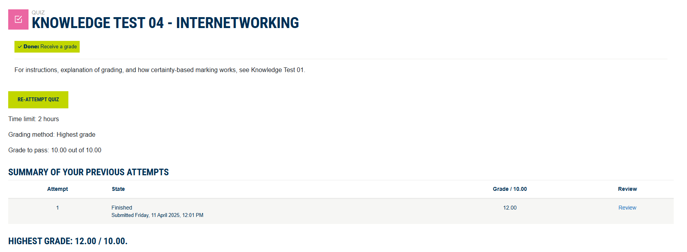
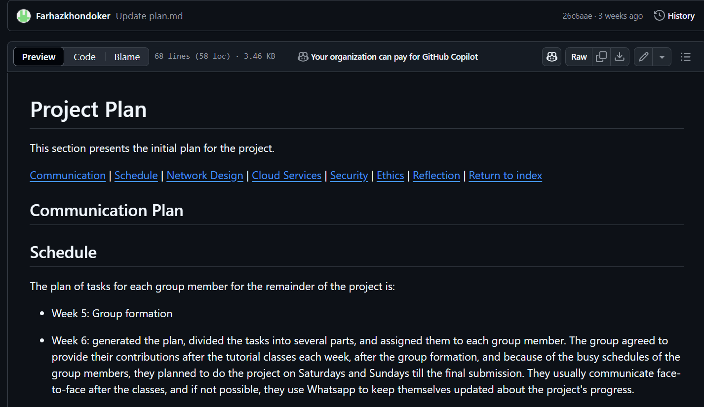
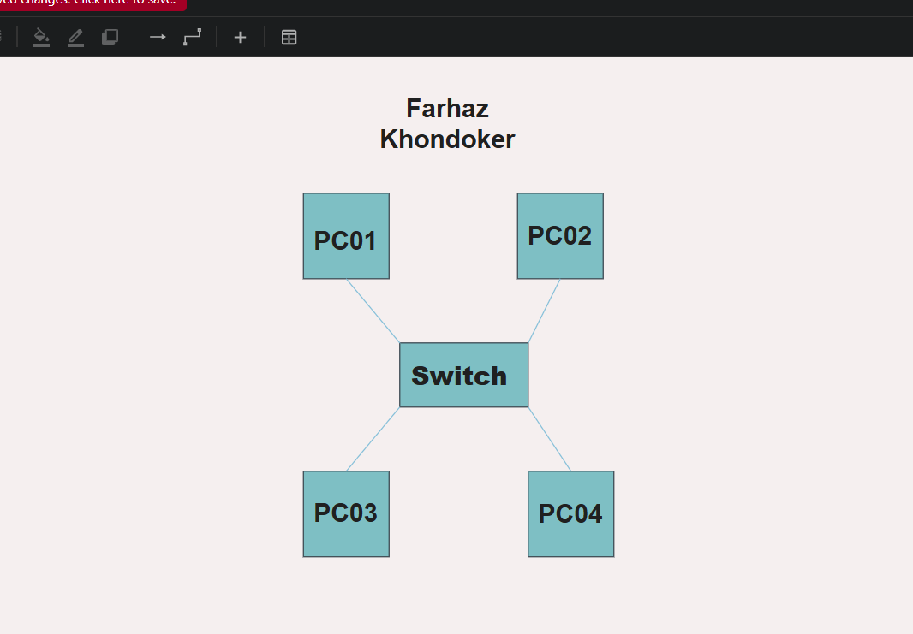
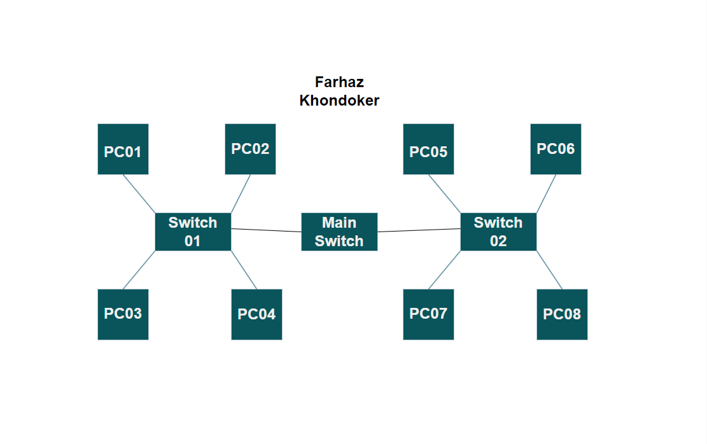
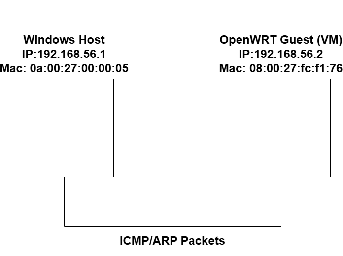
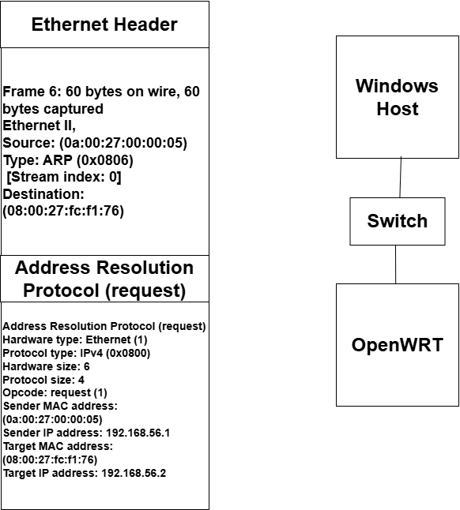
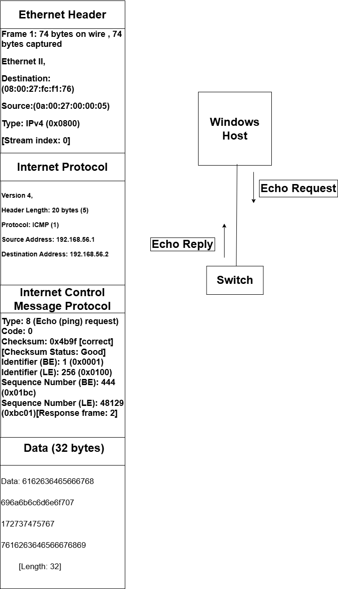
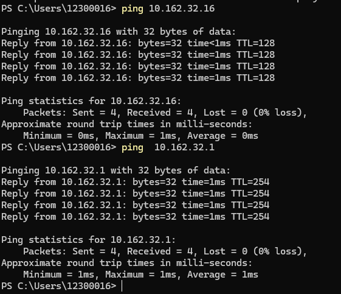

# Week 4 | Network Technologies

## Task 1 Knowledge test

## Task 2. Project Initiation
+ Group: **SYD Group 31**
+ Group Members:
  - **Farhaz Khondoker. Student Id: 12300016.**
  - **Vinit Kiritkumar Patel. Student Id: 12296781.**
+ URL of the project GitHub repository:   
+ Here is the screenshot of the plan.md file:
     
## Task 3 Draw Network Diagrams 
### Lan-A 

This screenshot represents the network connection between four personal computers and a switch.
### Draw.io file

### Lan-B

This screenshot represents the network connection between eight personal computers,two switches, and a main switch.
### Draw.io file

## Task 4 Analyse Ping Packet Capture
Based on the .
### Drawing a network diagram, labelling the devices with IP addresses and MAC addresses

### Draw.io file

### Drawing a network diagram of 1st ARP packet that shows encapsulation

### Draw.io file

### Drawing a network diagram of 1st ICMP packet that shows encapsulation

### Draw.io file

### ARP packets
ARP is needed when a device wants to communicate with another device on the same local network but doesn't know the target’s MAC address.
In this case:
Sender: Windows Host.
Why: To send an ICMP Echo Request (ping), the sender needs the destination's MAC address.
To Whom: ARP request is broadcast to all devices on the LAN (destination MAC = ff:ff:ff:ff:ff:ff), and the OpenWRT device responds with its MAC.

### First Two ICMP packets
#### Packet 1: ICMP Echo Request
Type: 8 (Echo Request)
Code: 0
Sender: Windows Host
Purpose: To check if the OpenWRT host is reachable.

#### Packet 2: ICMP Echo Reply
Type: 0 (Echo Reply)
Code: 0
Sender: OpenWRT
Purpose: Confirms receipt of ping; responds with the same data.

## Task 5 View ARP Table [Optional]

1. MAC Address: b0-7b-25-1f-a7-67
- IP Address: 10.162.32.16
- Device: Lab Computer 1
- Reason: This IP is known to be a desktop in the same lab room. It is reachable because it's shown the ARP Table.

2. MAC Address: 70-6e-6d-b9-c3-d5
- IP Address: 10.162.32.1
- Device: Default Gateway (router)
- Reason: This IP is the default gateway for the network. I accessed a website, which caused the computer to communicate with the router, making it show up in the ARP table.

