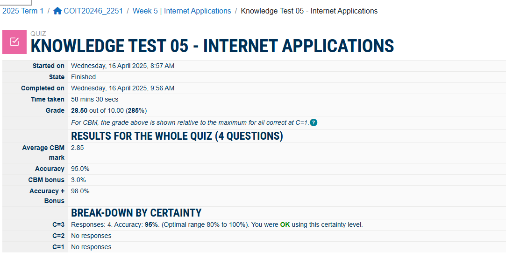
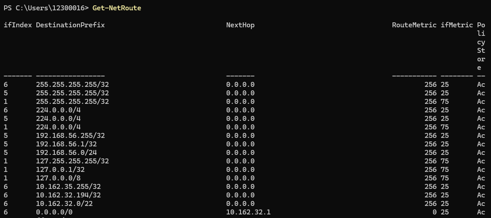
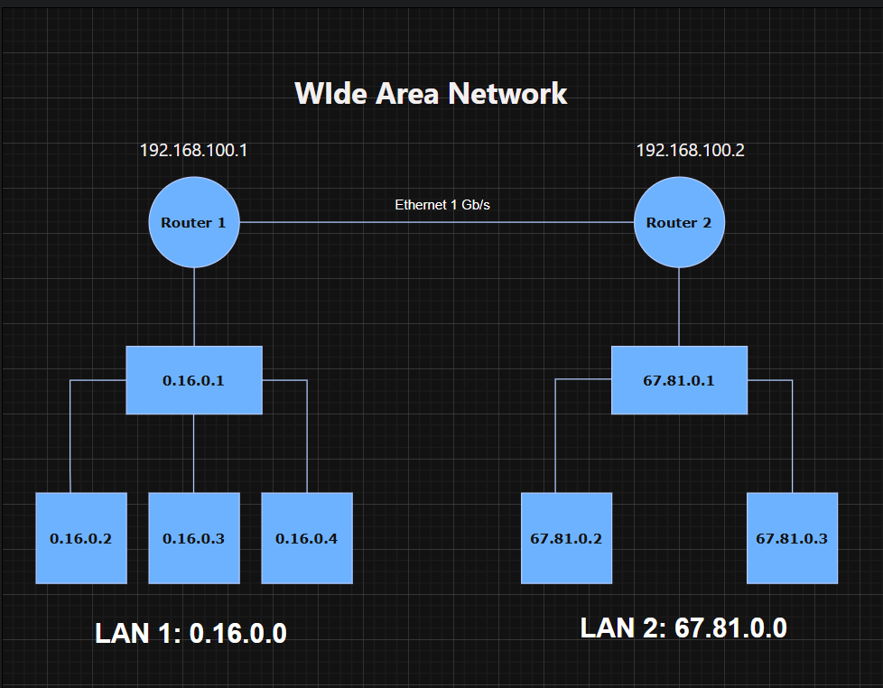
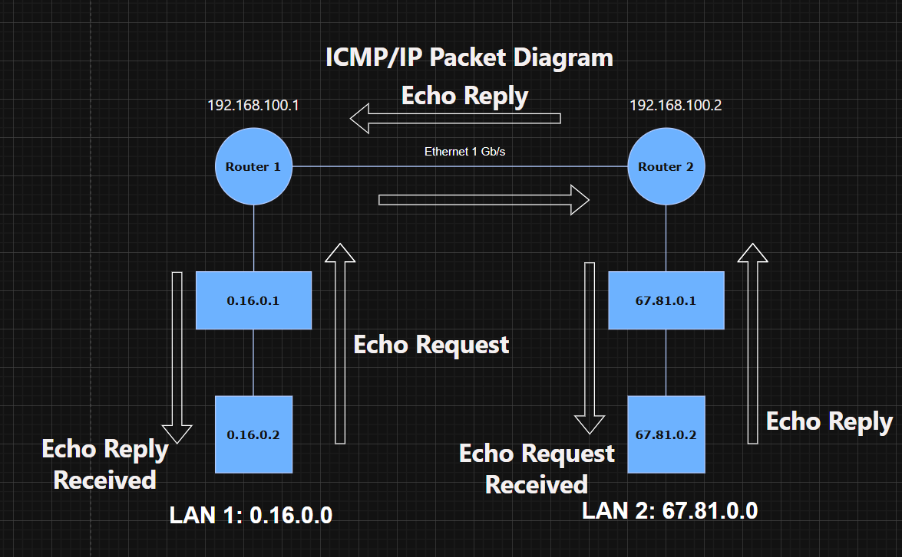
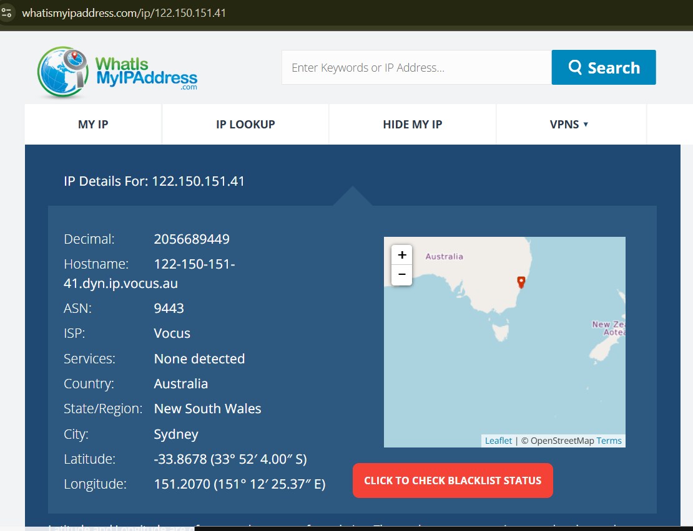
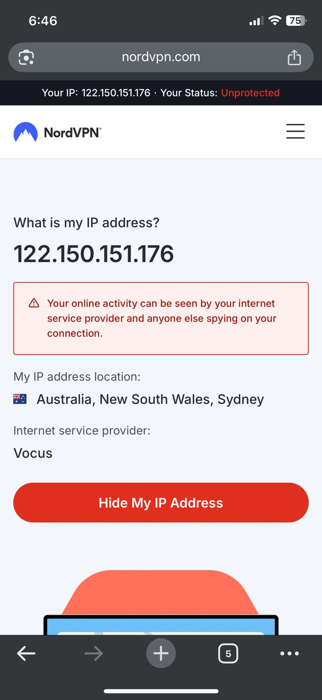

# Week 5 | Internetworking

## Task 1 Knowledge test

## Task 2 View Routing Table 

This example routing table can be read as:
### 1 : Direct Networks 
In the routing table we can see that majority of IP addresses have 'NextHop = 0.0.0.0'  which means that data is sent directly. These are the followings where data is sent directly:

1. **255.255.255.255/32**:
   - **Broadcast address** for a single IP. It is used to send packets to all hosts on the local network.

2. **224.0.0.0/4**:
   - **Multicast address range**. This range is used for multicast groups, allowing a single packet to be delivered to multiple destinations.

3. **192.168.56.255/32**:
   - **Broadcast address** for the 192.168.56.0 network. It is used to send packets to all hosts within the 192.168.56.0/24 network.

4. **192.168.56.1/32**:
   - **Single IP address**. This is a specific host within the 192.168.56.0/24 network. Example: Router.

5. **192.168.56.0/24**:
   - **Network range** from 192.168.56.0 to 192.168.56.255. This includes all IP addresses within this range.

6. **127.255.255.255/32**:
   - **Broadcast address** for the loopback network. It is used to send packets to all loopback addresses.

7. **127.0.0.1/32**:
   - **Loopback address**. This is used by a host to send packets to itself.

8. **127.0.0.0/8**:
   - **Loopback network range**. This includes all IP addresses from 127.0.0.0 to 127.255.255.255, used for loopback purposes.

9. **10.162.35.255/32**:
   - **Broadcast address** for the 10.162.32.0 network. It is used to send packets to all hosts within the 10.162.32.0/22 network.

10. **10.162.32.194/32**:
    - **Single IP address**. This is a specific host within the 10.162.32.0/22 network.

11. **10.162.32.0/22**:
    - **Network range** from 10.162.32.0 to 10.162.35.255. This includes all IP addresses within this range.

### 2 : Indirect Networks

1. **0.0.0.0/0**:
    - **Default route**. This applies to all IP addresses not covered by more specific routes. It is used to route packets to the next hop, which in this case is 10.162.32.1. This ensures that all traffic not explicitly routed by other entries will be forwarded to the specified next hop.

## Task 3 IP Network Design 
Project group Members: 

  + Student 1: **Farhaz Khoondoker** (Student Id : **12300016**)
  + Student 2: **Vinit Kiritkumar Patel** (Student Id : **12296781**)

Designing three IP networks using IPv4, each with a /24 subnet mask:

+ LAN1: My LAN (Farhaz) – using the last 4 digits of my student ID: **0016**, so base IP is **0.16.0.0/24**.
+ LAN2: Partner's LAN (Vinit) – **6781**, so base IP is **67.81.0.0/24**.
+ WAN: Arbitrary IP block for the point-to-point link **192.168.100.0/24**.

Here is the table of devices and IP addresses:
| Device   | Interface | IP Address     | Network            | Description               |
|----------|-----------|----------------|--------------------|---------------------------|
| PC1      | eth0      | 0.16.0.2       | LAN1 (0.16.0.0/24) | Test workstation          |
| PC2      | eth0      | 0.16.0.3       | LAN1               | Test workstation          |
| PC3      | eth0      | 0.16.0.4       | LAN1               | Test workstation          |
| Switch 1 | —         | —              | LAN1               | 8-port Gigabit switch     |
| R1       | eth0      | 0.16.0.1       | LAN1               | Default gateway for LAN1  |
| R1       | eth1      | 192.168.100.1  | WAN                | WAN side of router R1     |
| R2       | eth0      | 67.81.0.1      | LAN2               | Default gateway for LAN2  |
| R2       | eth1      | 192.168.100.2  | WAN                | WAN side of router R2     |
| Switch 2 | —         | —              | LAN2               | 8-port Gigabit switch     |
| PC4      | eth0      | 67.81.0.2      | LAN2(67.81.0.0/24) | Test workstation          |
| PC5      | eth0      | 67.81.0.3      | LAN2               | Test workstation          |

### eth0
- Refers to the first Ethernet interface on a device.
- Typically connects to the Local Area Network (LAN).
### eth1
- Refers to the second Ethernet interface on a device.
- Often used to connect to another network, like a Wide Area Network (WAN).
### Network diagram

The screenshot is about:
+ Two LANs (left = LAN1, right = LAN2)
+ Each LAN has its PCs connected to a switch.(LAN 1 = 3 pcs, LAN 2 = 2 pcs)
+ Each switch connects to its respective router.
+ The two routers connect via a WAN Ethernet link.

### Draw.io file:

### Routing Tables:
Routing table for both LAN's devices combinedly given below: 

| Destination      | Next Hop           |Interface |
|------------------|--------------------|----------|
| 0.16.0.0/24      | Directly Connected | eth0     |
| 192.168.100.0/24 | Directly Connected | eth1     |
| 67.81.0.0/24     | 192.168.100.2      | eth1     |
| 67.81.0.0/24     | Directly Connected | eth0     |
| 0.16.0.0/24      | 192.168.100.1      | eth1     |

### ICMP Packet Diagram (Ping Test)
Scenario: PC1 (0.16.0.2) pings PC4 (67.81.0.2).

### Draw.io file:

#### IP Header:
+ Source IP: 0.16.0.2
+ Destination IP: 67.81.0.2
#### ICMP Header:
+ Type: Echo Request (8)
+ Code: 0
#### Ethernet Frame:
+ Source MAC: R1’s WAN interface MAC (eth1)
+ Destination MAC: R2’s WAN interface MAC (eth1)

**Note:** At each hop, the IP header remains the same, but Ethernet MAC addresses change based on next hop.

## Task 4 Academic Integrity Outcomes
### Scenario 1: Plagiarism in an Assignment
**A student copies large sections from an online article into their essay without proper citation. The assignment is submitted as their own work.**
+ What could the student have done differently?
 - Ans: The student should have properly referenced all sources and used their own words to demonstrate understanding. Utilizing university resources on academic writing and referencing would help avoid plagiarism. They could have sought help from academic support services if unsure about referencing.
+ Level of breach and likely outcome (CQU policy)
 - Ans: This is a clear case of plagiarism, which is a serious breach of academic integrity.
According to CQU policy, outcomes may include a formal warning, requirement to redo the assessment with a reduced mark, or failing the assessment. For repeated or severe breaches, penalties can escalate to failing the unit or suspension.
The outcome is generally fair, as it maintains academic standards and protects students who work honestly.
+ Ramifications if not caught
 - Ans: The student may lack critical skills needed for future assessments or employment.
It undermines the value of the qualification for all students and can damage the university’s reputation8.
Other students may perceive cheating as acceptable if they see it going unpunished.
### Scenario 2: Collusion During Group Work
**Two students agree to share answers on an individual take-home exam, submitting very similar responses.**
+ What could the students have done differently?
 - Ans: They should have completed the assessment independently, as required by the instructions.
If unsure about collaboration rules, they could have clarified with their instructor.
+ Level of breach and likely outcome (CQU policy)
 - Ans: This is collusion, a form of academic misconduct.
Likely outcomes include a formal warning, reduced marks, or failing the assessment. For repeated or intentional deception, more severe penalties apply.
The policy aims to be fair by discouraging dishonest collaboration and protecting students who follow the rules.
+ Ramifications if not caught.
 - Ans: Students may continue to rely on dishonest practices, missing out on learning.
It creates an unfair environment and may encourage further breaches among peers.
## Task 5 IP Address Lookup 
### My personal computer's IP Infomration by **https://whatismyipaddress.com/**

### My personal mobile's IP Infomration by **https://nordvpn.com/**

+ My exact location?
  - Both of the website do not share the accurate location of my devices but it shows my state and country where device currently being operated.
+  My city?
   - It shows the exact city where the devices are currently being operated.
+  My computer IP?
   - At first, when I was searching from the website: [what is My IP address](https://whatismyipaddress.com/) in both of my laptop and mobile phone, the IP result similar which in my opinion should be. Then, I searched in [NordVPN's Website](https://nordvpn.com/) and found that my mobile phone's IP address is different.
+  Someone else’s IP?
   - In my opinion, the IP adresses that return from the renowned websites are true, because same addresses were found while searching on other websites.
