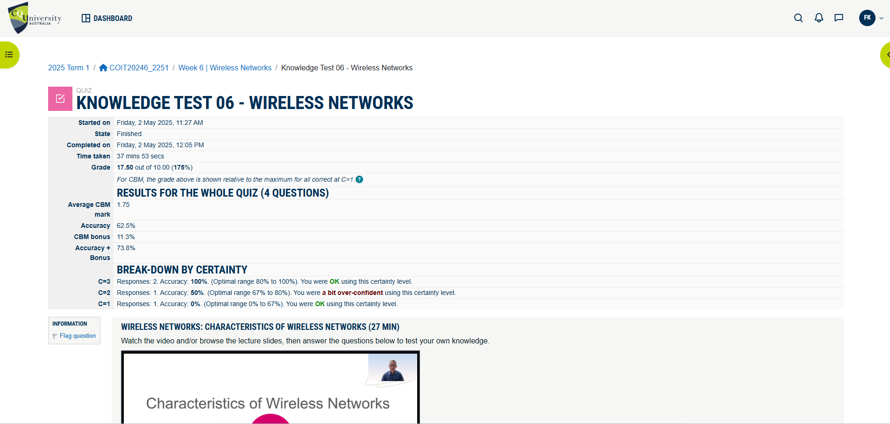
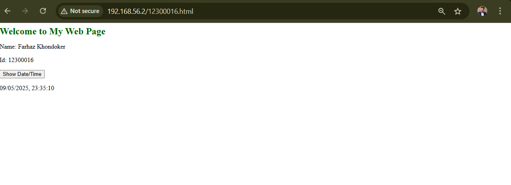
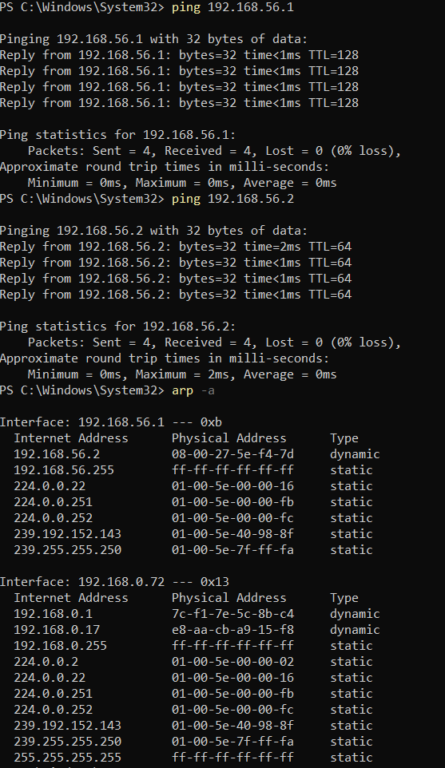
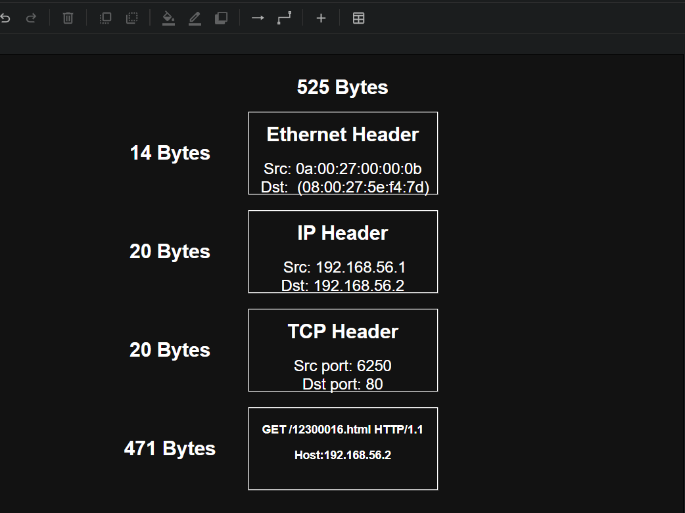

# Week 6 | Internet Applications

## Task 1 Knowledge test

## Task 2 Create Web Pages in OpenWRT
I have created the custom webpages by editing the index.html file and created new files as in 12300016.html and mystyle.css . The below website provide data related to my name and ID and also the current date and time.

The screenshot clearly visualize the criteria of displaying name, ID, and date.

**Here are the files related to the page:**

## Task 3 Capture HTTP Packets
Here is the Pcap file that is captured in response to the newly created webpage:

### ARP Table

**Text version of the ARP Table**

+ Devices shown in the ARP table with a MAC address and Type: dynamic are “reachable.”
+ If the MAC address appears as all zeroes or blanks, it's not reachable.
+ The router and any other computer that are successfully pinged will appear as reachable.

## Task 4 Analyse HTTP Packet Capture

### **A. HTTP Request/Response Descriptions:**

- Frame 33:
  
  + Triggered by: User entered the website URL in the browser. For example: http://192.168.56.2.
  + Request: GET / HTTP/1.1
  + Response: Not shown in this frame, but typically returns the main page (likely seen in Frame 37 as 200 OK).

- Frame 37:

  + Triggered by: Server responded to the initial GET request.
  + Request:  requested in frame 33.
  + Response: HTTP/1.1 200 OK, Content-Type: text/html(8 lines).

- Frame 39:

  + Triggered by: Browser trying to fetch favicon.
  + Request: GET /favicon.ico HTTP/1.1 .
  + Response: Response in frame 42.

- Frame 42:

  + Triggered by: Page included a request to a missing file.
  + Request: Request in frame 39.
  + Response: Not found, but likely a 200 OK or a 404.

- Frame 51:
  
  + Triggered by: Possibly a button click or a script causing page reload.
  + Request: GET / HTTP/1.1
  + Response: HTTP/1.1 200 OK.

- Frame 54:

  + Triggered by: Server responded to the initial GET request.
  + Request:  requested in frame 51.
  + Response: HTTP/1.1 200 OK, Content-Type: text/html(16 lines).

- Frame 55:

  + Triggered by: Loading of a linked CSS file.
  + Request: GET /mystyle.css HTTP/1.1
  + Response: HTTP/1.1 200 OK (text/css).

- Frame 58:

  + Triggered by: Server responded to the initial GET request.
  + Request:  requested in frame 55.
  + Response: HTTP/1.1 200 OK, Content-Type: text/css(2 lines).

### **B. First HTTP Request/Response Address Values (Frame 33):**

  + Source IP: 192.168.56.1
  + Destination IP: 192.168.56.2
  + Source Port: 6250
  + Destination Port: 80
  + Application Protocol: HTTP/1.1

### **C. Button to Show Date and Time:**
No additional HTTP request appears to be sent when the button is clicked. This likely means the action is handled via client-side JavaScript, without needing to contact the web server again.

### **D. Packet Diagram for Request to /12300016.html (Frame 51):**

This diagram completes the knowledge of the relevant data related to the HTTP request.
**Here is the draw.io file:**

### **E. Referrer for /12300016.html Request:**
It would be the previously loaded page. It identifies the page that initiated the request. Web servers use this to:

 + Analyze user navigation.
 + Improve UX or content placement.
 + Perform access control or log analysis.

### **F. Web browser:**
'Mozilla/5.0 (Windows NT 10.0; Win64; x64) AppleWebKit/537.36 (KHTML, like Gecko) Chrome/136.0.0.0 Safari/537.36'

### **G. HTTP Version and Transport Protocol:**
+ HTTP Version: HTTP/1.1
+ Transport Protocol: TCP (Transmission Control Protocol)

### **H. Connection-oriented service setup and timing**
#### Packets involved in TCP connection setup (3-way handshake):
  + Packet 30: SYN from client (192.168.56.1 to 192.168.56.2).
  + Packet 31: SYN, ACK from server.
  + Packet 32: ACK from client (completes the handshake).

#### First data transfer:
  + Packet 33: Client sends HTTP GET / HTTP/1.1
  + Time between start of setup and data transfer:
  + Start: Packet 30 at 13.789273 seconds.
  + First HTTP GET: Packet 33 at 13.801814 seconds.
  + Time elapsed ≈ 0.0125 seconds.

### **I. Identify the acknowledgements and their role**
#### Acknowledgement (ACK) Packets:
  + Packet 32: ACK (final part of handshake)
  + Packet 34: Server ACKs the HTTP GET
  + Packet 36, 38, 41, 43, 53, 57, 59, 70: ACKs following data segments

#### When is an ACK typically sent?

  + After receiving a segment of data: to confirm successful receipt
  + As part of the 3-way handshake: to establish a connection
  + During connection teardown: to confirm FIN segment receipt
  + With data (PSH, ACK): to piggyback ACK on data for efficiency
  + Purpose: ACKs ensure reliable data delivery, allowing retransmission if data is lost or corrupted.

## Task 5 Cookies
When I visited my.cqu.edu.au, I found that the site sets a number of cookies in my browser. These cookies store information such as my language preferences, session ID, and user role (e.g., staff or student). Some cookies are used for analytics and tracking, like Google Analytics (_ga, _gid) and Facebook Pixel (_fbp), which help the university understand how the site is being used. Other cookies track marketing campaigns or store temporary session data to maintain login status. The presence of cookies like AspNetCore.Cookies and SC_SessionId also suggest that session and security management is handled through cookies. No directly personal information was visible in the cookie names or values, but they do reflect how the website customizes my experience and tracks engagement.

