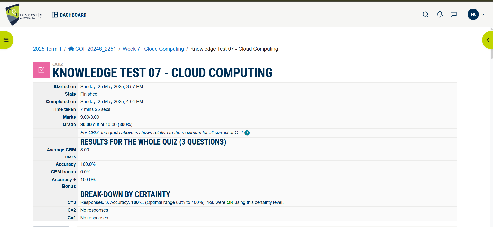
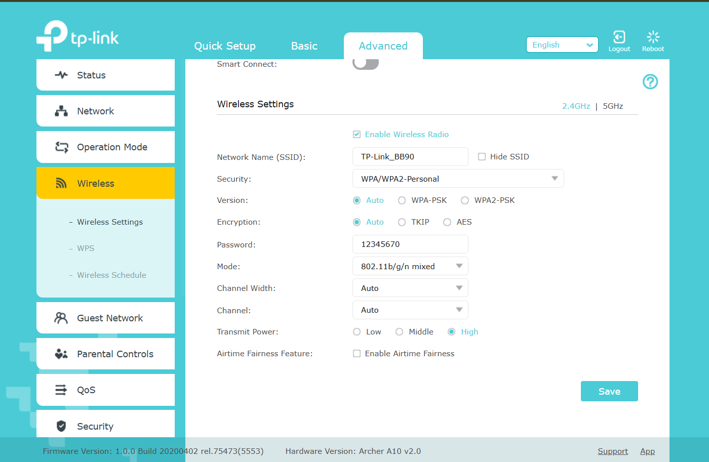
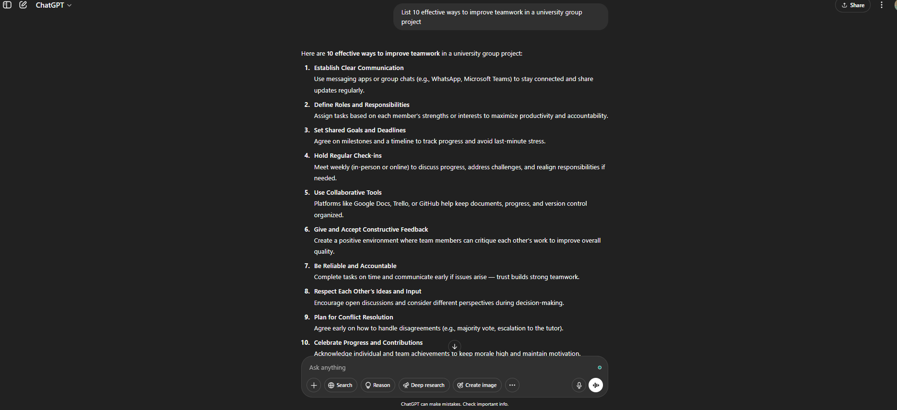
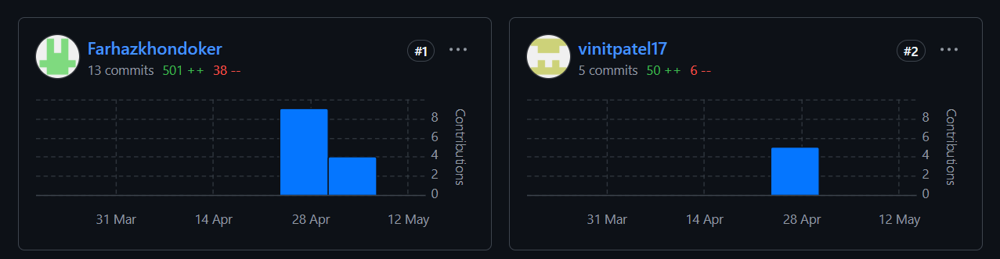

# Week 7 | Wireless Networks

## Task 1 Knowledge test

## Task 2 View Wi-Fi Details
These are details of my WIFI at home. I have collected the information using Powershell in my Laptop.

- SSID 1 : Zamee_5Ghz
- Network type            : Infrastructure
- Authentication          : WPA2-Personal
- Encryption              : CCMP
- BSSID 1                 : 7c:f1:7e:5c:8b:c2
- Signal             : 94%
- Radio type         : 802.11ax
- Band               : 5 GHz
- Channel            : 44
- QoS MSCS Supported    : 0
- QoS Map Supported     : 0
- Basic rates (Mbps) : 6 12 24
- Other rates (Mbps) : 9 18 36 48 54
         
### Explanation:
+ SSID 1: Zamee_5Ghz
   - This is the network name (SSID) that the device sees when scanning for Wi-Fi networks.

+ Network type: Infrastructure
   - Means this network is running in Infrastructure Mode, where all devices connect through a router or access point (not directly to each other).

+ Authentication: WPA2-Personal
   - This is the security protocol used.
   - WPA2-Personal is the most common home Wi-Fi encryption standard.
   - Uses a pre-shared password (PSK) to connect.

+ Encryption: CCMP
   - CCMP (Counter Mode with Cipher Block Chaining Message Authentication Code Protocol) is the encryption method used with WPA2.
   - It's based on AES encryption and provides strong security.

+ BSSID: (Hidden for privacy purposes)
   - This is the MAC address of the Access Point's wireless interface.
   - Unique identifier for the specific AP the device is connecting to.

+ Signal: 94%
   - Very strong signal strength.
   - Indicates the device is very close to the AP or router.

+ Radio type: 802.11ax
   - This is Wi-Fi 6, the latest generation of Wi-Fi at the time.
   - Offers better speed, efficiency, and support for many connected devices.

+ Band: 5 GHz
   - This is the frequency band used by this AP.
   - 5 GHz is faster but has shorter range compared to 2.4 GHz.
   - Less interference from other household devices.

+ Channel: 44
   - Wi-Fi channels are segments of the frequency band.
   - Channel 44 is a 5 GHz channel.
   - likely to have less congestion than 2.4 GHz.

+ QoS MSCS Supported / QoS Map Supported: 0
   - Indicates whether Quality of Service (QoS) for certain traffic types (like video or voice) is supported.
   - 0 means not supported by this AP or the OS isn't using it.

+ Basic Rates: 6, 12, 24 Mbps
+ Other Rates: 9, 18, 36, 48, 54 Mbps
   - These are supported data rates the AP can operate at.
   - Basic rates are required to maintain the connection.
   - Higher rates (like 54 Mbps) are possible with good signal and low interference.

## Task 3 Use Wi-Fi Access Point
**Here is the screenshot of using TPLink's emulator:**

As part of exploring wireless network design, I used the TP-Link web emulator for the Archer AX10 Wi-Fi 6 router. The emulator simulates the router’s web interface, allowing me to examine and understand various configuration settings that are critical for setting up a secure and efficient Wi-Fi network. Below is a summary of the most important settings and my recommendations for optimizing them.

| **Setting**               | **Recommended Configuration & Justification**                                                                   |
| ------------------------- | --------------------------------------------------------------------------------------------------------------- |
| **SSID (Network Name)**   | Rename to something unique and identifiable, such as `FarhazCQU`, for branding and easy recognition.   |
| **Encryption**            | Use **WPA3-Personal** if supported, or **WPA2-Personal** at a minimum, to ensure strong network encryption.     |
| **Wireless Password**     | Set a complex password (at least 12 characters, using letters, numbers, and symbols) for improved security.     |
| **Channel Selection**     | Set to **Auto**, or manually select a channel with less interference (using tools like Wi-Fi Analyzer).         |
| **Bandwidth Mode**        | For 5 GHz, enable **20/40/80 MHz Auto** to maximize performance and compatibility.                              |
| **Guest Network**         | Enable with **Internet-only access** (no LAN access) — ideal for customers and keeps the internal network safe. |
| **MAC Address Filtering** | Enable and restrict to known devices only, to control who can connect to the network.                           |
| **Disable WPS**           | Turn off **Wi-Fi Protected Setup (WPS)**, as it is a known security vulnerability.                              |

## Task 4 Self-Evaluation of Teamwork
### 1. Teamwork Improvement Suggestions from Generative AI: ChatGPT
Prompt Used:

"List 10 effective ways to improve teamwork in a university group project"

**AI-Generated Suggestions:**

- Clear communication among team members.
- Setting shared goals and deadlines.
- Delegating tasks based on strengths.
- Regular meetings or check-ins.
- Using shared tools (e.g., Trello, GitHub).
- Providing constructive feedback.
- Being accountable and meeting deadlines.
- Respecting everyone’s opinions.
- Conflict resolution strategies.
- Celebrating small wins and progress.

### 2. Comparison

| **Suggestion**                | **Are We Practicing It?** | **Example or Improvement Needed**                                                     |
| ----------------------------- | ------------------------- | ------------------------------------------------------------------------------------- |
| Clear communication           |  Yes                     | We use a WhatsApp group to share updates and clarify tasks.                           |
| Shared goals and deadlines    |  Yes                     | We created a shared checklist of deliverables and set internal deadlines.             |
| Delegating tasks by strengths |  Yes                     | I focused on network design; Vinit handled documentation and diagrams.                |
| Regular check-ins             |  No                      | We only met once in Week 1 — should set weekly 15-min syncs.                          |
| Using shared tools (GitHub)   |  Yes                     | We committed our work and used Issues for task tracking.                              |
| Constructive feedback         |  No                      | We haven’t reviewed each other’s work — we should do peer reviews.                    |
| Accountability                |  Yes                     | Each of us completed our assigned part on time so far.                                |
| Respect for opinions          |  Yes                     | Discussions are respectful and inclusive during meetings.                             |
| Conflict resolution           |  Not Needed Yet          | No conflicts occurred, but we should agree on a process just in case.                 |
| Celebrating progress          |  No                      | We haven’t acknowledged milestones — we could share a weekly “win” in our group chat. |

### 3. GitHub Commit Activity Review

#### My Contribution:
I have made 13 commits, mostly related to the network topology design, configuration planning, and readme documentation.

#### My Teammate's Contribution (Vinit):

Vinit has made 5 commits, focused on project documentation, diagram formatting, and subnet planning.

### 4. Analysis & Plan for Improvement
+ Compared to My Team: I have made slightly more commits and handled more of the technical configurations.

+ Compared to Other Teams: We are on track, but some teams show more frequent, smaller commits — we can adopt that for better version control.

+ Improvement Plan:
   - Schedule short weekly team check-ins (15–20 mins).
   - Review each other’s work before the final commit.
   - Divide remaining tasks more granularly for more equal contribution.
   - Celebrate our next milestone completion to maintain motivation.
