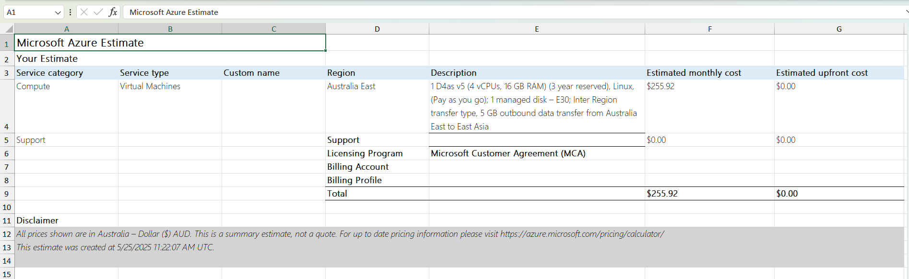

# Week 8 | Cloud Computing

## Task 1 Knowledge test


## Task 3 Create an Azure Resource

The screenshot demonstrates the Azure resource creation time.


Based on the screenshot, the Microsoft Azure portal has generated some of the resources, the following resources were created. Here’s a list of each resource along with a brief explanation of its purpose:

### **List of Azure Resources and Their Purpose**

1. **my-VM-51399511**
   **Type:** Virtual Machine
   **Purpose:** This is the main virtual machine instance that acts as a computer in the cloud. It runs an operating system and can host applications or services, just like a physical computer.

2. **my-VM-51399511-ip**
   **Type:** Public IP Address
   **Purpose:** Provides a public IP address for the virtual machine, enabling external access to it over the internet (e.g., via SSH or RDP).

3. **my-VM-51399511-nsg**
   **Type:** Network Security Group (NSG)
   **Purpose:** Acts as a virtual firewall. It controls inbound and outbound traffic to network interfaces or subnets associated with the virtual machine using rules.

4. **my-VM-51399511-vnet**
   **Type:** Virtual Network (VNet)
   **Purpose:** Provides a logically isolated network in the Azure cloud where the virtual machine and other resources are deployed. It allows secure communication between Azure resources.

5. **my-vm-51399511487\_z1**
   **Type:** Network Interface
   **Purpose:** Connects the virtual machine to the virtual network. It facilitates communication between the VM and other networked resources.

6. **my-VM-51399511\_disk1\_ecc2292cc423433bb886...**
   **Type:** Disk
   **Purpose:** This is the virtual hard disk attached to the virtual machine. It stores the operating system, applications, and data for the VM.

## Task 4 Create an Azure Virtual Machine and Allow Web
Access

### az Commands Used
``` azurecli
az vm create \
--resource-group myRGKV-lod51633844 \
--name my-VM-51633844 \
--image Ubuntu2204 \
--admin-username azureuser \
--generate-ssh-keys' '''

'az vm extension set \
--resource-group myRGKV-lod51633844 \
--vm-name my-VM-51633844 \
--name customScript \
--publisher Microsoft.Azure.Extensions \
--version 2.1 \
--settings '{"fileUris":["https://raw.githubusercontent.com/MicrosoftDocs/mslearn-welcome-to-azure/master/configure-nginx.sh"]}' \
--protected-settings '{"commandToExecute": "./configure-nginx.sh"}'

ssh -l azureuser IPADDRESS

Host Key Verification Failed error?
If you receive a “Host Key Verification Failed” error, then try to add the -o StrictHostKeyChecking=no option
to the send of the ssh command as follows:
ssh -l azureuser IPADDRESS -o StrictHostKeyChecking=no

sudo nano /var/www/html/index.html
```
### Public IP Address of My VM: **20.186.3.102**

### Screenshot of the Website created in the virtual machine


**The screenshot presents my name and student ID**

### Network Security Rules


+ SSH Rule
   - Port: 22
   - Name: default-allow-ssh
   - Purpose: Allows secure shell (SSH) access so you can connect to the VM.

+ HTTP Rule
   - Port: 80
   - Name: AllowAnyHTTPInbound
   - Purpose: Allows web traffic (HTTP) so users can access the Nginx-hosted webpage.

## Task 5 Compare Cloud vs On-premise Costs

| Feature              | **Allied Stinger Gaming PC**              | **Azure VM (D4as v5)**                        |
| -------------------- | ----------------------------------------- | --------------------------------------------- |
| **CPU**              | AMD Ryzen 5                               | 4 vCPUs (D4as v5)                             |
| **GPU**              | NVIDIA RTX 3060                           | None                                          |
| **RAM**              | 16 GB DDR4                                | 16 GB                                         |
| **Storage**          | 1 TB SSD                                  | 128 GB OS Disk (E30 Managed Disk)             |
| **Operating System** | Windows 11                                | Ubuntu (Linux)                                |
| **Upfront Cost**     | A\$1,299 (one-time)                       | A\$0.00                                       |
| **Monthly Cost**     | None                                      | A\$255.92                                     |
| **Yearly Cost**      | A\$1,299 (one-time)                       | A\$3,071.04                                   |
| **3-Year Cost**      | A\$1,299 (one-time)                       | A\$9,213.12                                   |
| **GPU Capability**   | Suitable for gaming, design, AI workloads | Not suitable (no GPU support on D-series VMs) |

### The Screenshot of the Allied Stinger Gaming PC


### The Screenshot of the Azzure Virtual Machine Cost from CSV file


## Trade-off Discussion

### Consumer Desktop (Allied Stinger Gaming PC)

**Advantages:**
- One-time purchase with no ongoing subscription cost.
- Includes a dedicated **GPU (RTX 4060)**, suitable for gaming, design, and AI workloads.
- Full control over hardware and software configuration.
- Can be used offline without internet dependency.

**Disadvantages:**
- Requires user management of maintenance, updates, power, and physical security.
- Limited scalability; hardware upgrades need physical changes or replacement.
- Not ideal for remote access or distributed environments.


### Cloud Virtual Machine (Azure D4as v5)

**Advantages:**
- No upfront hardware purchase cost.
- Scalable — you can upgrade, downgrade, or clone instances easily.
- Ideal for web hosting, development, and business-critical cloud apps.
- Includes built-in redundancy, high availability, backup, and monitoring.

**Disadvantages:**
- Higher long-term cost — approx. **A$9,200 over 3 years**.
- No GPU included in this VM tier — not suitable for graphic-intensive tasks.
- Requires an internet connection and understanding of cloud infrastructure.
- Shared resource model may lead to performance variability.


###  Conclusion

The **Allied Stinger Gaming PC** is a better choice for users who need strong local performance and GPU capability at a lower long-term cost. On the other hand, the **Azure VM** offers unmatched flexibility and scalability, making it ideal for cloud-based workloads and business services.

Choosing the **desktop PC** for performance-heavy local tasks, and the **Azure VM** for scalable cloud infrastructure would be the best choice.
