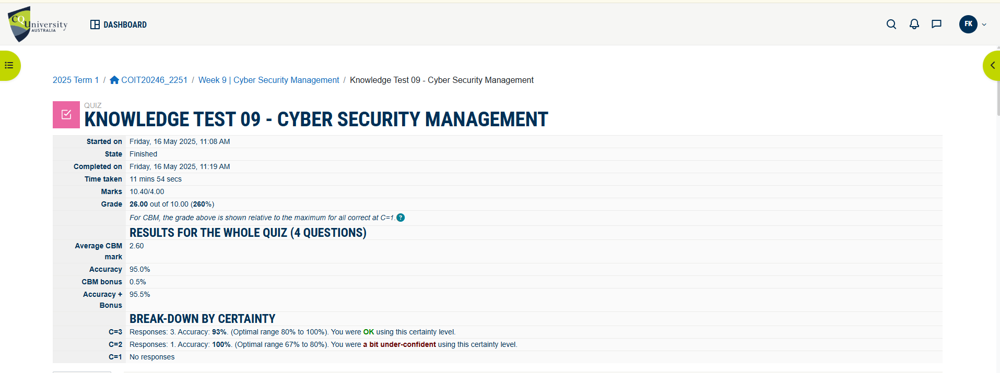

# Week 9 | Attacks and Vulnerabilities

## Task 1 Knowledge test

## Task 2 CIA Protections

The table below lists selected important assets from the project along with the most critical CIA (Confidentiality, Integrity, Availability) protection and a justification for each.

| Asset                        | CIA Protection   | Reason                                                                 |
|-----------------------------|------------------|------------------------------------------------------------------------|
| Customer Database           | Confidentiality  | Contains personal data — unauthorized access could lead to privacy breach. |
| Financial Records           | Integrity        | Must ensure accuracy to avoid accounting errors and fraud.             |
| Employee Records            | Confidentiality  | HR data includes sensitive personal and legal information.             |
| Travel Booking Data         | Availability     | Must be accessible for bookings, updates, and customer service.        |
| HQ Server 1                 | Availability     | Hosts critical applications — downtime impacts all users.              |
| Consultant Laptop           | Confidentiality  | May store customer data locally — must be protected from unauthorized access. |
| CRM System                  | Integrity        | Any alteration could affect customer management processes.             |
| HQ Firewall                 | Availability     | Network protection depends on this — if it's down, entire network is vulnerable. |
| CCTV Camera 1               | Availability     | Video surveillance must be recording in real-time to be effective.     |
| RFID Reader 1               | Integrity        | Access logs and physical security depend on accurate readings.         |
| IT Administrator            | Confidentiality  | Has high-level access to systems — misuse or breach could be catastrophic. |
| Accountant                  | Integrity        | Responsible for financial data — errors or tampering must be prevented. |

## Task 3: Threat Sources and Motivation

This table identifies the most likely threat sources (attackers) for our networked system and their motivations:

| Threat Source             | Motivation                                                                 |
|---------------------------|----------------------------------------------------------------------------|
| Neighbour or Local Attacker | Wants to gain free Wi-Fi access or misuse network resources.              |
| Competitor Company        | Seeks to obtain sensitive business data or disrupt services for advantage. |
| Disgruntled Employee      | May attempt sabotage or data theft out of anger or revenge.                |
| Cybercriminal/Hacker      | Financial gain via ransomware, data theft, or identity fraud.              |
| Nation-State Actor        | Political or economic espionage targeting key business data.               |
| Phishing Attacker         | Wants to steal login credentials and access internal systems.              |
| Former Consultant or Contractor | Retains unauthorized access and may attempt to exploit it for profit or sabotage. |
| Hacktivist                | Aims to damage reputation or disrupt services for ideological reasons.     |

## Task 4: CVE Summary Report

##  Critical Severity: CVE-2025-1182
- **CVE ID**: [CVE-2025-1182](https://nvd.nist.gov/vuln/detail/CVE-2025-1182)
- **Description**: A vulnerability in GNU Binutils 2.43, specifically in the `bfd_elf_reloc_symbol_deleted_p` function of `bfd/elflink.c`, leads to memory corruption.
- **Date**: Disclosed in early 2025
- **CVSS v3 Score**: Not yet officially scored by NVD, but classified as **Critical**
- **CIA Impact**:
  - **Confidentiality**: Low
  - **Integrity**: Low
  - **Availability**: Low
- **CWE**: CWE-119 – Improper Restriction of Operations within the Bounds of a Memory Buffer
- **Company**: GNU Project
- **Product**: GNU Binutils – a collection of binary tools used in software development
- **Simple Explanation**: The vulnerability allows attackers to corrupt memory by exploiting a flaw in how symbols are relocated in ELF files. This could potentially lead to remote code execution.
- **Detection/Mitigation**:
  - Apply the patch: [Git commit](https://sourceware.org/git/gitweb.cgi?p=binutils-gdb.git;h=b425859021d17adf62f06fb904797cf8642986ad)
  - Use memory safety tools and fuzzing to detect similar issues.

##  High Severity: CVE-2024-5522
- **CVE ID**: [CVE-2024-5522](https://nvd.nist.gov/vuln/detail/CVE-2024-5522)
- **Description**: The HTML5 Video Player WordPress plugin (before v2.5.27) fails to sanitize and escape a REST route parameter, allowing unauthenticated SQL injection.
- **Date**: June 2024
- **CVSS v3 Score**: Not yet officially scored, but classified as **High**
- **CIA Impact**:
  - **Confidentiality**: High
  - **Integrity**: High
  - **Availability**: High
- **CWE**: CWE-89 – Improper Neutralization of Special Elements used in an SQL Command ('SQL Injection')
- **Company**: WordPress plugin developer (third-party)
- **Product**: HTML5 Video Player – used to embed and manage video content on WordPress sites
- **Simple Explanation**: Attackers can inject malicious SQL commands via a REST API endpoint, potentially gaining access to or modifying the database.
- **Detection/Mitigation**:
  - Update to version 2.5.27 or later
  - Use web application firewalls (WAFs)
  - Regularly audit and sanitize inputs

##  Medium Severity: CVE-2024-4899
- **CVE ID**: [CVE-2024-4899](https://nvd.nist.gov/vuln/detail/CVE-2024-4899)
- **Description**: The SEOPress WordPress plugin (before v7.8) does not properly sanitize and escape post settings, allowing stored XSS by high-privilege users.
- **Date**: June 2024
- **CVSS v3 Score**: Not yet officially scored, but classified as **Medium**
- **CIA Impact**:
  - **Confidentiality**: Low
  - **Integrity**: Low
  - **Availability**: Low
- **CWE**: CWE-79 – Improper Neutralization of Input During Web Page Generation ('Cross-site Scripting')
- **Company**: SEOPress
- **Product**: SEOPress – a WordPress plugin for SEO optimization
- **Simple Explanation**: High-privilege users can inject malicious scripts into posts, which are then executed when viewed by others.
- **Detection/Mitigation**:
  - Update to SEOPress v7.8 or later
  - Implement strict input validation and output encoding
  - Use Content Security Policy (CSP) headers

## Task 5: Vulnerability Disclosure Issues

### Introduction
Vulnerability disclosure is a critical aspect of cybersecurity. It involves the process of reporting and addressing security vulnerabilities in software and hardware products. This document discusses the issues surrounding vulnerability disclosure, including reasons for vendor delays, reasonable disclosure timelines, and whether researchers should disclose vulnerabilities without vendor consent. It also references responsible disclosure practices and bug bounty programs.

### Reasons for Vendor Delays
Vendors may take time before making a vulnerability public for several reasons:
1. **Assessment and Verification**: Vendors need time to assess and verify the reported vulnerability to ensure its validity and understand its impact.
2. **Development of Patches**: Creating and testing patches or fixes for the vulnerability can be time-consuming. Vendors aim to provide a reliable solution that does not introduce new issues.
3. **Coordination with Stakeholders**: Vendors may need to coordinate with other stakeholders, such as partners, customers, and regulatory bodies, before disclosing the vulnerability.
4. **Minimizing Panic**: Immediate disclosure without a fix can lead to panic and exploitation of the vulnerability. Vendors may delay disclosure to minimize the risk of widespread attacks.

### Reasonable Disclosure Timelines
A reasonable disclosure timeline balances the need for transparency with the need for effective remediation. Common practices include:
- **30 to 90 Days**: Many responsible disclosure policies recommend a 30 to 90-day window for vendors to address the vulnerability before it is made public.
- **Extensions**: In some cases, vendors may request extensions if they are actively working on a fix and need more time.

### Should Researchers Disclose Without Vendor Consent?
The decision to disclose a vulnerability without vendor consent is complex and depends on various factors:
- **Ethical Considerations**: Researchers should consider the potential harm to users and the ethical implications of disclosing without consent.
- **Vendor Responsiveness**: If a vendor is unresponsive or unwilling to address the vulnerability, researchers may feel compelled to disclose to protect users.
- **Legal Implications**: Researchers should be aware of legal implications and potential consequences of disclosing without vendor consent.

### Responsible Disclosure Practices
Responsible disclosure involves reporting vulnerabilities to vendors in a manner that allows them to address the issue before it is made public. Key practices include:
- **Coordinated Disclosure**: Researchers and vendors work together to ensure the vulnerability is addressed and disclosed in a coordinated manner.
- **Bug Bounty Programs**: Many vendors offer bug bounty programs that incentivize researchers to report vulnerabilities responsibly. Examples include:
  - [OWASP Vulnerability Disclosure Cheat Sheet](https://cheatsheetseries.owasp.org/cheatsheets/Vulnerability_Disclosure_Cheat_Sheet.html)
  - [Microsoft Coordinated Vulnerability Disclosure](https://www.microsoft.com/en-us/msrc/cvd)
  - [Broadcom Vulnerability Management](https://www.broadcom.com/support/security-center/vulnerability-management)
  - [MITRE Researcher Reservation Guidelines](https://cve.mitre.org/cve/researcher_reservation_guidelines)

