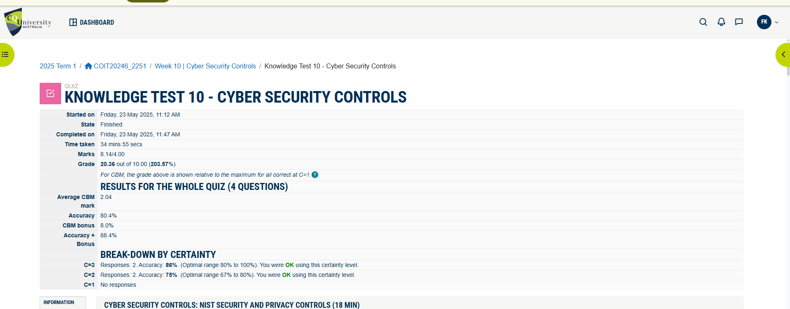

# Week 10 | Cyber Security Management

## Task 1 Knowledge test

## Task 2: Select Security Objectives

We need to select four sub-categories from the NIST Cybersecurity Framework (CSF), with two from the **Protect** function and two from the **Detect** function, each from different categories.

###  **Protect Function**

1. **Function: Protect**  
   **Category: Access Control (PR.AC)**  
   **Sub-category: PR.AC-1 – Identities and credentials are issued, managed, verified, revoked, and audited for authorized devices, users, and processes.**  
   **Importance:** Ensures only authorized users and devices can access systems, especially critical for remote staff and branch offices.  
   **Mitigates:** Unauthorized access, credential theft, insider threats.

2. **Function: Protect**  
   **Category: Data Security (PR.DS)**  
   **Sub-category: PR.DS-1 – Data-at-rest is protected.**  
   **Importance:** The agency stores sensitive customer and financial data. Protecting data-at-rest is essential for compliance and trust.  
   **Mitigates:** Data breaches, ransomware, physical theft of storage devices.

###  **Detect Function**

3. **Function: Detect**  
   **Category: Anomalies and Events (DE.AE)**  
   **Sub-category: DE.AE-1 – A baseline of network operations and expected data flows for users and systems is established and managed.**  
   **Importance:** Helps detect unusual behavior, especially useful for identifying compromised accounts or malware.  
   **Mitigates:** Zero-day attacks, insider threats, lateral movement in networks.

4. **Function: Detect**  
   **Category: Security Continuous Monitoring (DE.CM)**  
   **Sub-category: DE.CM-7 – Monitoring for unauthorized personnel, connections, devices, and software is performed.**  
   **Importance:** Critical for identifying rogue devices or unauthorized access attempts, especially with WiFi and remote work.  
   **Mitigates:** Rogue access points, unauthorized device connections, shadow IT.

## Task 3: Create Asset Inventory

You need to list assets across six types. Below are example tables for each type, including fake identifiers and classifications where needed.

###  **1. Data Assets**

| Asset Name             | Description                          | Classification | CIA Priority | Protection Needed         |
|------------------------|--------------------------------------|----------------|--------------|---------------------------|
| Customer Database      | Personal and travel data             | Confidential   | High         | Encryption, Access Control|
| Financial Records      | Payroll, invoices, transactions      | Confidential   | High         | Encryption, Backup        |
| Employee Records       | HR data                              | Confidential   | Medium       | Access Control, Audit Logs|
| Travel Booking Data    | Booking history and preferences      | Sensitive      | Medium       | Access Control, Monitoring|

###  **2. Hardware Assets**

| Asset Name         | Type         | Serial Number | Location        |
|--------------------|--------------|---------------|-----------------|
| HQ Server 1        | Dell PowerEdge| DELL-HQ-001   | HQ Server Room  |
| Branch Router 1    | Cisco Router | CIS-BR-101    | Sydney Branch   |
| Consultant Laptop  | Lenovo ThinkPad | LEN-TR-202 | Remote/Home     |

###  **3. Software Assets**

| Software Name       | Version | License Key     | Installed On     |
|---------------------|---------|------------------|------------------|
| CRM System          | v5.2    | CRM-KEY-2025     | HQ Server 1      |
| Accounting Software | v3.1    | ACC-KEY-2025     | HQ Workstations  |
| Antivirus           | v10.0   | AV-KEY-2025      | All Endpoints    |

###  **4. Network Assets**

| Asset Name     | Type         | MAC Address       | IP Address     |
|----------------|--------------|-------------------|----------------|
| HQ Firewall    | Fortinet 100F| 00:1A:2B:3C:4D:5E | 78.10.0.1      |
| Branch Switch  | Cisco 2960   | 00:1B:2C:3D:4E:5F | 78.20.0.2      |

###  **5. Physical Assets**

| Asset Name     | Type         | Location         | Identifier     |
|----------------|--------------|------------------|----------------|
| CCTV Camera 1  | Surveillance | HQ Entrance      | CAM-HQ-ENT-01  |
| RFID Reader 1  | Access Control | HQ Main Door   | RFID-HQ-01     |

###  **6. People Assets**

| Role              | Department     | Access Level | Device Assigned |
|-------------------|----------------|--------------|------------------|
| Travel Consultant | Sales          | Medium       | Laptop           |
| IT Administrator  | IT             | High         | Desktop + Server |
| Accountant        | Finance        | Medium       | Desktop          |

