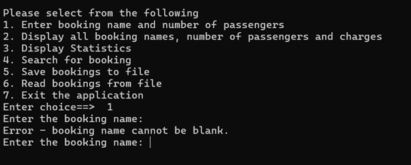

# Nemo Reef Tours Booking System – Testing Report

This document records all test cases performed on the **Nemo Reef Tours Booking System**.  
Each test includes the scenario, expected behavior, sample console output, and placeholders for screenshots.

---

## Test 1 – Entering a Valid Booking

**Description:**  
User enters a valid booking name and passenger count.  

**Scenario:**  
Booking name: `Farhaz Khondoker`  
Passengers: `8`  

**Expected Result:**  
- Input accepted  
- 15% discount applied  
- Receipt printed with correct charge  

**Console Output Example:**
```text
Enter the booking name: Farhaz Khondoker
Enter number of passengers for Farhaz Khondoker: 8

Booking Name: Farhaz Khondoker
Passengers: 8
Total Charge: $649.70
```

## Test 2
**Description:** Booking name left blank. Expect error message and retry prompt.
**Expected Result:**
- Error message shown
- Program reprompts until valid name entered

**Console Output Example:**
Enter the booking name: 
Error - booking name cannot be blank.
Enter the booking name: Farhaz

## Test 3
**Description:**
User enters zero passengers.
**Expected Result:**
- Error message shown
- Program reprompts until valid passenger count entered Console
**Output Example:**
  Enter number of passengers for Farhaz: 0
Error - number of passengers must be at least 1.
Enter number of passengers for Farhaz: 3

