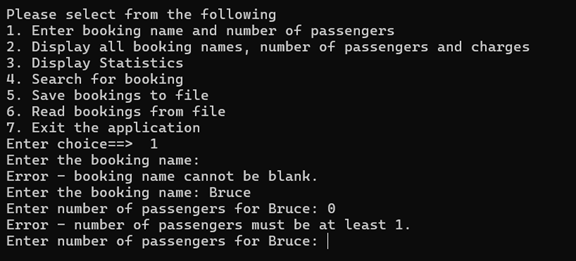
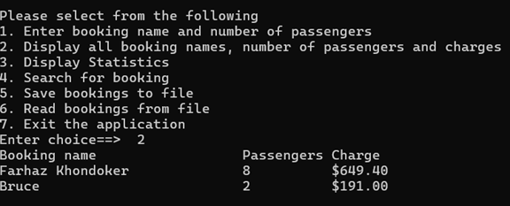
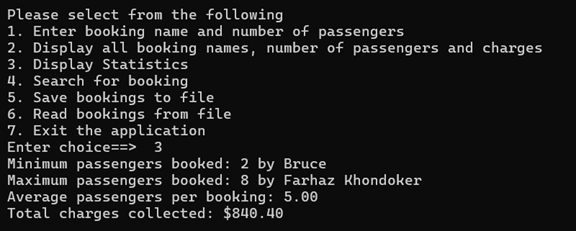
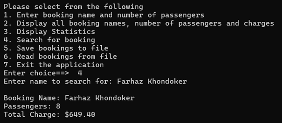
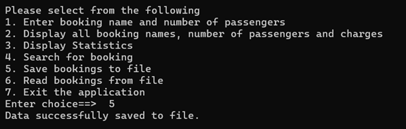
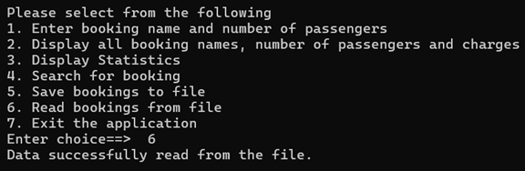

# Nemo Reef Tours Booking System – Testing Report

This document records all test cases performed on the **Nemo Reef Tours Booking System**.  
Each test includes the scenario, expected behavior, sample console output, and placeholders for screenshots.

---

## Test 1

**Description:**  
User enters a valid booking name and passenger count.  

## Test 2
**Description:** Booking name left blank. Expect an error message and a retry prompt.

## Test 3
**Description:**
User enters zero passengers.

## Test 4
**Description:** User requests to display all bookings. 

## Test 5
**Description:** User requests statistics of all bookings.

## Test 6

**Description:** User searches for a booking name in lowercase.

## Test 7

**Description:** User saves current bookings to a CSV file.

## Test 8
**Description:** User reads bookings from the existing CSV file.

